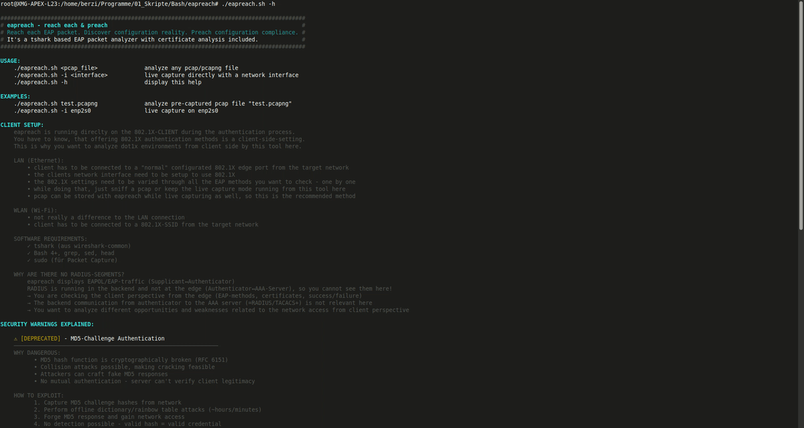
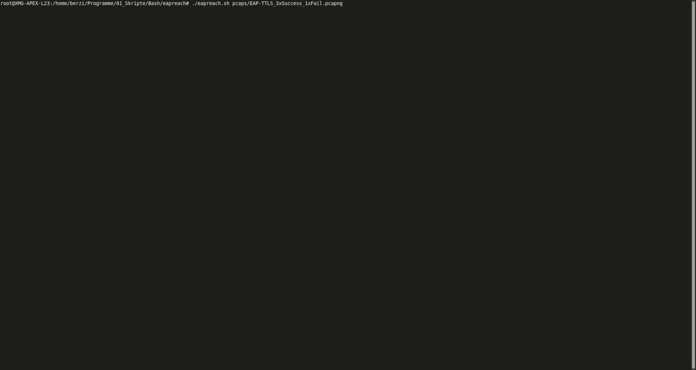
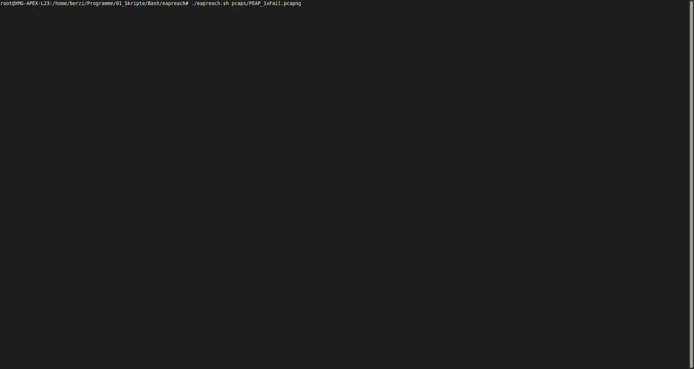

# eapreach

**reach each** & **preach**

**Reach each** EAP packet. Discover configuration reality. **Preach** configuration compliance.

A powerful, client-side **802.1X/EAP packet analyzer** with integrated certificate validation. Understand what really happens during enterprise Ethernet and Wi-Fi authentication.

---

## What is eapreach?

`eapreach` is a **tshark-based EAP analyzer** that runs directly on your client device during authentication. Unlike traditional packet sniffing from a separate machine, eapreach shows you the **client perspective** of the entire EAP handshake in real-time.

### Why is this useful?

| Scenario | eapreach helps by... |
|----------|----------------------|
| **Troubleshooting 802.1X failures** | Shows where auth breaks (Identity? Certificate? TLS handshake?) |
| **Testing different EAP methods** | Validate EAP-TLS, EAP-TTLS, PEAP, MD5-Challenges |
| **Certificate validation** | Automatically detects self-signed certs, issuer chains, expiration dates |
| **Security auditing** | Identifies deprecated methods (MD5), downgrade attacks (Legacy NAK), MITM risks |
| **Device testing** | Check if a specific device supports modern EAP methods |

---

## How it works

```
CLIENT (running eapreach)
    ↓
    ├─ Initiates 802.1X/EAP authentication
    ├─ eapreach captures EAPOL/EAP frames in real-time
    ├─ Decodes EAP method, certificate details, TLS handshake
    ├─ Flags security warnings (deprecated, downgrade, self-signed)
    └─ Shows: Success ✓ or Failure ✗

AUTHENTICATOR (AP/Switch) ← Backend RADIUS (not visible to eapreach)
    ↓
    └─ Server-side auth (invisible from client perspective)
```

**Key point:** eapreach shows what the **client sees**, not backend RADIUS communication.

---

## Output Examples

### Help
> [!TIP]
> <details>
>    <summary>Screenrecord - <strong>Help</strong> <em>(click for watching)</em></summary>
>
>
>
></details>

This is what the help looks like. Security warnings are explained there.

### Live Capture
> [!TIP]
> <details>
>    <summary>Screenrecord - <strong>Live Capture</strong> <em>(click for watching)</em></summary>
>
>
>
></details>

Sadly there was no live-data while recording :'-( <br>
You would see each new EAP packet incoming, marked by relevant and interesting information.

### Successful MD5 Authentication
> [!TIP]
> <details>
>    <summary>Screenrecord - <strong>MD5 Authentication</strong> <em>(click for watching)</em></summary>
>
>
>
></details>

You can see the sniffed identity of "bob" (what is not an issue).<br>
There is a sniffed deprecated MD5-Hash (what is an issue).<br>
MD5 is cryptographically broken. This network is vulnerable.

### Failed EAP-TTLS Authentication
> [!TIP]
> <details>
>    <summary>Screenrecord - <strong>EAP-TTLS Authentication</strong> <em>(click for watching)</em></summary>
>
>
>
></details>

There are several issues.<br>
You can see that there is a downgrade message, MD5 hashes in use and also a self signed certificate for the TLS tunnel.<br>
The more certificate information is displayed human readable.


### Multiple EAP-TTLS Authentications
> [!TIP]
> <details>
>    <summary>Screenrecord - <strong>Multiple Authentications</strong> <em>(click for watching)</em></summary>
>
>
>
></details>

This shows that you can analyze as much as authentications you want to in a row.


### Failed PEAP Authentication
> [!TIP]
> <details>
>    <summary>Screenrecord - <strong>PEAP Authentication</strong> <em>(click for watching)</em></summary>
>
>
>
></details>

PEAP is also working. You can see the same issues as in the EAP-TTLS tunneling here.


---

## Security Warnings Explained

> [!WARNING]
> <details>
>    <summary><strong>[DEPRECATED] - MD5-Challenge</strong> <em>(click for details)</em></summary>
>
>**Why dangerous:**
>- MD5 hash function is cryptographically broken (RFC 6151)
>- Collision attacks make cracking feasible (~hours with modern GPUs)
>- Attackers can craft fake MD5 responses
>- No mutual authentication—server can't verify client legitimacy
>
>**How to exploit:**
>```
>1. Capture MD5 challenge from network (visible in eapreach output)
>2. Perform offline dictionary/rainbow table attack
>3. Forge MD5 response to impersonate user
>4. No detection possible—valid hash = valid credential
>```
>
>**Remediation:**
>```
>→ Disable MD5-Challenge on all RADIUS/NAS servers immediately
>→ Configure only: EAP-TLS, EAP-TTLS, PEAP, EAP-FAST, EAP-TEAP
>→ Force minimum TLS 1.2 for tunnel-based methods
>→ Audit all devices—replace hardware that can't do EAP-TLS
>```
>
></details>

---

> [!WARNING]
> <details>
>    <summary><strong>[DOWNGRADE] - Legacy NAK Fallback Attack</strong> <em>(click for details)</em></summary>
>
>**Why dangerous:**
>- Legacy NAK forces server to negotiate weaker EAP methods
>- RFC 3748 Section 4.3 explicitly lists this as an attack vector
>- Can be injected by attacker during authentication
>- Enables attacks on deprecated methods (e.g., MD5-Challenge)
>
>**How to exploit:**
>```
>1. Attacker intercepts EAP-Request (e.g., for EAP-TTLS)
>2. Injects Legacy NAK: "Client can't do this method"
>3. Server falls back to MD5-Challenge (much weaker)
>4. Attacker cracks MD5 instead of TLS (drastically easier)
>```
>
>**Remediation:**
>```
>→ REJECT Legacy NAK responses on all NAS/RADIUS servers
>→ Enable only strong EAP types (whitelist model)
>→ Monitor logs for Legacy NAK → indicates old/non-compliant hardware
>→ Identify and replace devices that don't support modern EAP
>→ Consider EAP-TLS enforcement only (zero downgrade risk)
>```
>
></details>

---

> [!WARNING]
> <details>
>    <summary><strong>[SELF-SIGNED] - Self-Signed Certificate</strong> <em>(click for details)</em></summary>
>
>**Why dangerous:**
>- No Certificate Authority validation (Subject == Issuer)
>- Client has no way to verify server identity authentically
>- Perfect setup for Man-in-the-Middle (MITM) attacks
>- Attacker can present any self-signed cert—client will "accept" it
>
>**How to exploit:**
>```
>1. Attacker sets up rogue AP on same network
>2. Client connects, server (attacker) presents self-signed cert
>3. Client has NO way to verify legitimacy (no CA chain to check)
>4. Attacker acts as transparent proxy: Client ↔ Attacker ↔ Real Server
>5. Attacker decrypts/modifies/captures all EAP traffic
>```
>
>**Remediation:**
>```
>→ Use ONLY certificates from trusted CAs (DigiCert, Let's Encrypt, etc.)
>→ Import CA root cert on all clients (certificate pinning)
>→ Verify cert chain on client side (WPA2-Enterprise policy)
>→ Monitor logs for self-signed certificates
>→ Educate users: REJECT unknown certificate warnings
>```
>
></details>

---

## Usage

### Installation

#### System Requirements

- **Linux-System**
- **Bash 4.0+**
- **tshark** (from wireshark-common or wireshark-cli)
- **Standard Unix tools:** grep, sed, head, ip
- **sudo** (for live packet capture)

#### Prerequisites

```bash
# Ubuntu/Debian
sudo apt install wireshark-common tshark bash

# RHEL/CentOS
sudo yum install wireshark bash

# Arch
sudo pacman -S wireshark-cli bash
```

#### No Installation Required

`eapreach` is a single-file Bash script. Just run it directly:


### Connection Type

#### LAN (Ethernet) - 802.1X Port
Your client must be physically connected to a 802.1X-enabled switch port.

#### WLAN (Wi-Fi) - 802.1X
Your client must be connected to (or attempting to connect to) the 802.1X-protected SSID.


### Starting the Analysis

#### Live Mode (Real-Time Capture)

Monitor authentication as it happens:

```bash
# Live capture on Ethernet interface
sudo ./eapreach.sh -i eth0

# Live capture on Wi-Fi interface
sudo ./eapreach.sh -i wlan0
```

Press `Ctrl+C` to stop. You'll be prompted to save the capture file.

#### File Mode (Offline Analysis)

Analyze a previously captured PCAP file:

```bash
./eapreach.sh capture.pcapng
./eapreach.sh /path/to/eap_auth.pcapng
```

#### Help

```bash
./eapreach.sh -h
```

Shows complete usage, examples, and detailed security explanations.

---

## Understanding the Output Format

```
Frame | EAPOL Type          | EAP Type             | EAP Code             | Details
────────────────────────────────────────────────────────────────────────────────────
123   | Start               |                      |                      | 
124   | EAP Packet          | Identity             | Request              | 
125   | EAP Packet          | Identity             | Response             | Identity: user@example.com
126   | EAP Packet          | EAP-TLS              | Request              | TLS: Client Hello(1)
```

**Columns:**
- **Frame:** Packet number in capture
- **EAPOL Type:** Start, EAP Packet, Success, Failure, Logoff
- **EAP Type:** Identity, MD5-Challenge, EAP-TLS, EAP-TTLS, PEAP, etc.
- **EAP Code:** Request, Response, Success, Failure
- **Details:** TLS handshake, certificates, warnings, username, etc.

---

## More Examples

### Audit Network Security

```bash
# Save a capture
sudo ./eapreach.sh -i eth0
# (authenticate, then Ctrl+C)
# Saves to: eap_capture_20250213_091530.pcapng

# Analyze it multiple times
./eapreach.sh eap_capture_20250213_091530.pcapng
./eapreach.sh eap_capture_20250213_091530.pcapng | grep DEPRECATED
./eapreach.sh eap_capture_20250213_091530.pcapng | grep SELF-SIGNED
```

### Test Multiple EAP Methods

Create different supplicant configs and test each:

```bash
# Test EAP-TLS
sudo ./eapreach.sh -i eth0

# Test EAP-TTLS
sudo ./eapreach.sh -i eth0

# Test PEAP
sudo ./eapreach.sh -i eth0
```

Compare outputs to understand which methods work and their security posture.

---

## Real-World Use Cases

### 🎓 Network Administrators
- **Deploy 802.1X:** Verify correct certificate, test all client types
- **Troubleshoot:** "Why is Device X failing to auth?" → See exact EAP failure point
- **Audit:** Ensure deprecated methods (MD5) are truly disabled
- **Monitor:** Watch authentication handshakes during security assessments

### 🔒 Security Teams
- **Penetration Testing:** Detect MITM vulnerabilities (self-signed certs, downgrade attacks)
- **Compliance:** Prove that only strong EAP methods are in use
- **Incident Response:** Analyze captured authentications for anomalies
- **Policy Validation:** Verify certificate pinning, TLS versions, cipher suites

### 👨‍💻 Developers
- **Client Software:** Debug why your app fails 802.1X auth
- **Device Firmware:** Verify EAP implementation correctness
- **Testing:** Create repeatable test scenarios with recorded captures

---

## Troubleshooting

### "Permission denied" error

Live packet capture requires root:

```bash
# Use sudo
sudo ./eapreach.sh -i wlan0

# Or analyze a previously saved file (no sudo needed)
./eapreach.sh capture.pcapng
```

### "tshark not found"

```bash
# Ubuntu/Debian
sudo apt install wireshark-common

# RHEL/CentOS
sudo yum install wireshark

# Arch
sudo pacman -S wireshark-cli
```

### No EAP packets captured

**Possible causes:**

- Interface not connected to 802.1X network
- Authentication already completed (start capture *before* connecting)
- Wrong interface name (use `ip link show` to list)
- Port on switch not configured for 802.1X

---

## EAP Methods Supported

| Method | Tunnel | Status |
|--------|--------|--------|
| EAP-Identity | No | ✅ Supported |
| MD5-Challenge | No | ✅ Supported |
| EAP-TLS | No | ❔ Should work |
| EAP-TTLS | Yes | ✅ Supported |
| PEAP | Yes | ✅ Supported |
| EAP-FAST | Yes | ❔ Should work |
| EAP-TEAP | Yes | ❔ Should work |

---

## Disclaimer

**eapreach** is a diagnostic tool for authorized network testing only.

- Capture packets **only on networks you own or have permission to test**
- Do not use to intercept unauthorized traffic
- Respect local laws regarding packet capture and network analysis
- Use responsibly for legitimate security purposes

---

## References

- **IEEE 802.1X:** Port-Based Network Access Control
- **RFC 3748:** Extensible Authentication Protocol (EAP)
- **RFC 5216:** EAP-TLS Authentication Protocol
- **RFC 5281:** Extensible Authentication Protocol Tunneled Transport Layer Security
- **RFC 2104:** HMAC: Keyed-Hashing for Message Authentication
- **RFC 6151:** Updated Security Considerations for MD5 and HMAC-MD5

---

**Questions?** Open an issue on GitHub or check the help: `./eapreach.sh -h`
